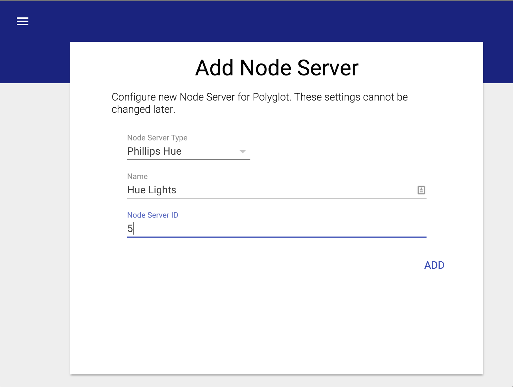

Usage
=====

Installation
~~~~~~~~~~~~

Polyglot is open source software provided under the MIT license.
There are two ways to install Polyglot. Either a binary compiled version
or the pure python (from source) version.

**Version 0.0.4 Released May 30th, 2016**

These methods are for linux debian x86 or raspbian on a rpi. 

Get the system pre-requisites: 

.. code-block:: bash

    apt-get install python-git python-pip python3-pip libjpeg-dev

Pure Python (aka non-compiled source)
-------------------------------------

Clone the repository to a directory under the user you wish to run Polyglot. This will not run as root.
eg. /home/pi/ the following line will create a directory called Polyglot so no need to do that.  

.. code-block:: bash

	git clone https://github.com/UniversalDevicesInc/Polyglot.git

Move yourself into the Polyglot directory

.. code-block:: bash

	cd Polyglot

Install the Python required modules this does require root as we want to install them globally
for Python to access.  

.. code-block:: bash

	sudo pip install -r requirements.txt
	
Run Polyglot!
	
.. code-block:: bash

	python -m polyglot -v

This will launch Polyglot and create a directory titled *config* in the current
directory. Polyglot will store all of its configuration and its log inside of
this directory. You may specify a manual path for this directory using the
command line flags.

COMPILED version (aka all-in-one)
---------------------------------

We will need to create a home for Polyglot  

.. code-block:: bash

	mkdir Polyglot && cd $_

We still need the python pre-requisites:  

.. code-block:: bash

	sudo pip install -r https://github.com/UniversalDevicesInc/Polyglot/raw/unstable-release/requirements.txt

Download the polyglot binary for your system. One of these:

For ARM (Raspberry Pi's)  
<https://github.com/UniversalDevicesInc/Polyglot/raw/unstable-release/bin/polyglot.linux.armv7l.pyz>

For x86 Linux flavors (Built with Debian sid):  
<https://github.com/UniversalDevicesInc/Polyglot/raw/unstable-release/bin/polyglot.linux.x86_64.pyz>

For MAC (Built on Yosemite)  
<https://github.com/UniversalDevicesInc/Polyglot/raw/unstable-release/bin/polyglot.osx.x86_64.pyz>

Make the file executable. Use the filename you downloaded. Example is the ARM version.

.. code-block:: bash

	chmod 755 polyglot.linux-arm7l.pyz

Run Polyglot!

.. code-block:: bash

	./polyglot.linux-arm7l.pyz -v

Command line flags
------------------

.. code-block:: bash

    -h, --help            show this help message and exit
    -c CONFIG_DIR, --config CONFIG_DIR
                          Polyglot configuration directory
    -v, --verbose         Enable verbose logging
    -vv                   Enable very verbose logging

While running in its default mode, Polyglot will log all warnings and errors.
Verbose logging will include info messages. Very verbose mode adds debug
messages that could be useful when developing a new node server.

OSX Instructions
----------------

Install XCODE Developer Tools (enables git)
The easiest way to do this is to go to the console and type:

.. code-block:: bash

    git

This will automatically launch the XCODE installer.

Once XCODE is installed run:

.. code-block:: bash

    sudo easy_install pip 

This installs pip 8.1.1 and now we are ready to get our binary or clone the github repository as
instructed above.

Start Polyglot on Boot
----------------------

If you are running the module you already have the polyglot.service file in your Polyglot root folder.
If not then get it like so:

.. code-block:: bash

    wget https://github.com/UniversalDevicesInc/Polyglot/raw/unstable-release/polyglot.service

Edit the file polyglot.service with your favorite editor.
Modify WorkingDirectory to be your root Polyglot directory. eg. /home/pi/Polyglot

.. code-block:: bash

    WorkingDirectory=/home/pi/Polyglot

Modify ExecStart to be how you start it. Full path needed.
For pure Python(Non-compiled):

.. code-block:: bash

    ExecStart=/usr/bin/python -m polyglot -v

For the compiled binary:

.. code-block:: bash

    ExecStart=/home/pi/Polyglot/polyglot.linux-arm7l.pyz -v

Change the user to the user account that will run polyglot (NOT ROOT)

.. code-block:: bash

    User=pi

Copy polyglot.service to /lib/systemd/system/ You need sudo as /lib/systemd/system is a system directory.

.. code-block:: bash

    sudo cp /home/pi/Polyglot/polyglot.service /lib/systemd/system/

Enable systemctl (Make sure polyglot isn't already running):

.. code-block:: bash

    sudo systemctl enable polyglot 
    sudo systemctl start polyglot

Logging locations
-----------------

Log file is found at config/polyglot.log. To watch the live action:

.. code-block:: bash

    tail -fn 50 /home/pi/Polyglot/config/polyglot.log

User Interface
~~~~~~~~~~~~~~
Once Polyglot is running, the user interface may be accessed by opening your
favorite browser and navigating to::

    http://localhost:8080

The default username and password are both *admin*.

If you are accessing the frontend from another machine, replace *localhost*
with the IP Address or URL of the machine running Polyglot. If you are having
trouble accessing the user interace from a remote machine, check your firewall
settings.

.. image:: _static/screenshots/settings.png
   :scale: 50 %
   :align: center

The user interface is designed to be simple and intuitive to use. Pictured
above is the settings page. Using the menu bar on the left, new node servers
can be added and existing node servers may be monitored. The button on the
bottom of the menu will open Polyglot's log in a new browser window.

The user interface is fully compatible with both tablet and mobile devices.

Settings
--------

The settings view allows the user to alter settings for Polyglot's HTTP server
as well as Polyglot's connection to the ISY controller. It is recomended that
the username and password are changed from the default. If a new different port
is desired, it may be set in the *Server Configuration* block.

It is also necessary to set the username, password, host name, and port
required for connecting to the ISY. These may be configured in the *ISY
Configuration* block.

Adding Node Server
------------------

To add a node server, navigate to the *Add Node Server* view using the menu.
This view is pictured above.

Populate this form with the details for the new node server. Select a type from
all installed types using the drop down. Give the node server any name allows
for easy recognition. Finally, populate the *Node Server ID* field with an ID
that is available in the ISY. Press *ADD* when complete.

The node server will now be available in Polyglot. You may navigate to it using
the menu. The node server view in Polyglot will show the Node Server ID, Base
URL, and allow for the Profile to be downloaded.

In order to access the node server from the ISY, it must be added to the ISY.
To do this, inside of the ISY console, navigate to Node Servers then Configure
then the Node Server ID that was set while creating the node server. This will
open a dialog that accepts all the information from the node server view.
Populate this with the Profile Name and Base URL from the node server view.
The User ID, Passsword, Host Name, and Port here must be the values used for
connecting to Polyglot. Timeout may be left as 0, and the Isy User should be
set to the appropriate user ID that was configured in Polyglot. If you are
unsure, use 0.

Click the *Upload Profile* button and navigate to the zip file obtained from
Polyglot's node server view. Once this has been uploaded, click *Ok* and
restart the ISY controller. Once the ISY has fully rebooted, restart the
node server in Polyglot using the node server view.

Managing Node Servers
---------------------

.. image:: _static/screenshots/view_ns.png
   :scale: 50 %
   :align: center

Clicking a Node Server in the menu will activate the node server view. In this
view, there is a menu bar at the top. This menu bar will indicate is the node
server is Running or Stopped. It also provides buttons to download the profile,
restart the node server, or delete the node server.

Also in this view are instructions for using this node server. Different node
servers may have their own instructions on how to use them in the ISY. Any
open-source, third party libraries that were used for the development of the
node server are also credited here.

If the node server were to crash, a red X will appear next to it in the menu
and it will be indicated in the menu bar on the top of the node server view.
If this happens, it is best to save the log for debugging and then restart the
node server using the button in the menu bar.

Viewing Polyglot Log
--------------------

There is a file icon below all the main menu items. Clicking this icon will
open Polyglot's log in a new browser window. This log file is critical for
debugging issues with Polyglot.
